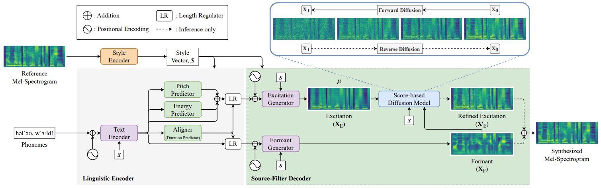
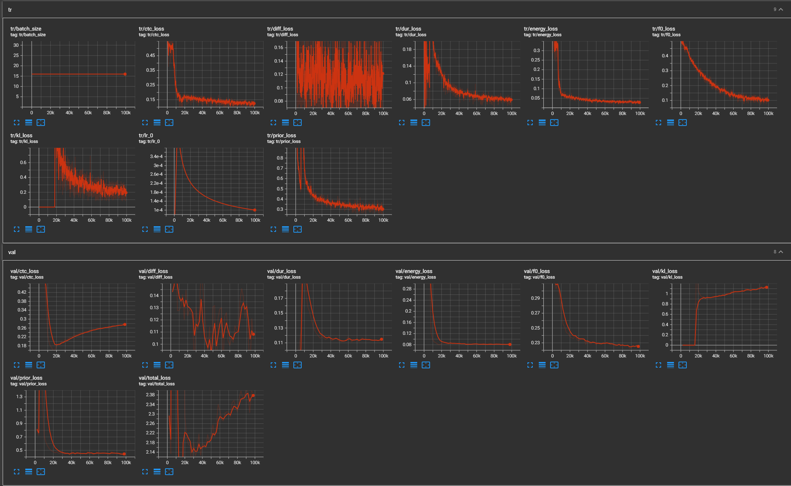
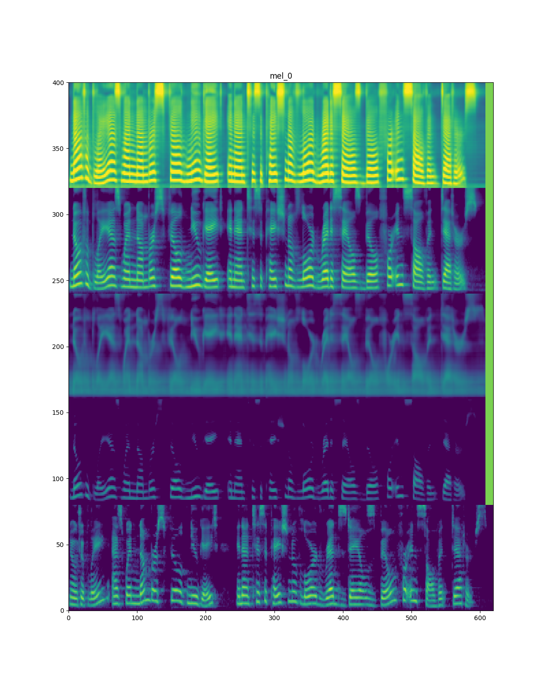
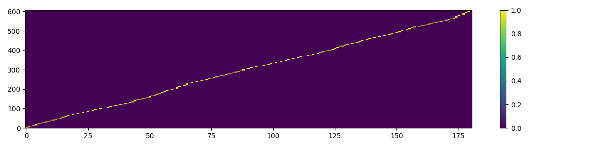

<!--
Hey, thanks for using the awesome-readme-template template.
If you have any enhancements, then fork this project and create a pull request
or just open an issue with the label "enhancement".

Don't forget to give this project a star for additional support ;)
Maybe you can mention me or this repo in the acknowledgements too
-->


# StableForm-TTS - Pytorch Implementation

PyTorch unofficial implementation of ["Improving Robustness of Diffusion-Based Zero-Shot
Speech Synthesis via Stable Formant Generation"](https://arxiv.org/pdf/2409.09311). 

<div align="center">
    
</div>

## Getting Started

### Dependencies 
```
pip install -r requirements.txt
```

#### Vocoder

- [HiFi-GAN](https://github.com/clovaai/voxceleb_trainer)
- [BigVGAN](https://github.com/NVIDIA/BigVGAN)

#### Dataset
Modify the config file to fit your environment.
```
# configs/datasets/lj/base_text2mel.yaml
raw_data_dir: ./dataset/LJSpeech-1.1
preprocess_cls: configs.datasets.lj.preprocess.LJPreprocess
processed_data_dir: ./dataset/processed/ljspeech
binary_data_dir: ./dataset/binary/ljspeech
...
```
The public dataset can be downloaded from the following link. 
[LJSpeech](https://keithito.com/LJ-Speech-Dataset/), [VCTK](https://datashare.ed.ac.uk/handle/10283/2651), [LibriTTS](https://www.openslr.org/60/)

#### Preprocess
```
# preprocess.sh
export PYTHONPATH=.
CONFIG="configs/models/tts/stableform_tts.yaml";
python data_gen/tts/runs/preprocess.py --config $CONFIG
python data_gen/tts/runs/binarize.py --config $CONFIG
```

#### Training
```
# run.sh 
export PYTHONPATH=.
DEVICE=0;
CONFIG="configs/models/tts/stableform_tts.yaml";
MODEL_NAME="StableFormTTS_libri16k";

CUDA_VISIBLE_DEVICES=$DEVICE python tasks/run.py \
    --config $CONFIG \
    --exp_name $MODEL_NAME \
    --reset \
    --hparams=$HPARAMS
```

### Inference
```
CUDA_VISIBLE_DEVICES=$DEVICE python tasks/run.py \
    --config $CONFIG \
    --exp_name $MODEL_NAME \
    --infer \
    --hparams=$HPARAMS \
    --reset
```

### Tensorboard 
#### Loss
<div align="center">
    
</div>

#### Mel-spectrogram 
<div align="center">
    
</div>

#### Alignment
<div align="center">
    
</div>

## References

- [NATSpeech](https://github.com/NATSpeech/NATSpeech)
- [RAD-TTS](https://github.com/NVIDIA/radtts)
- [Meta-StyleSpeech](https://github.com/KevinMIN95/StyleSpeech)
- [BigVGAN](https://github.com/NVIDIA/BigVGAN)